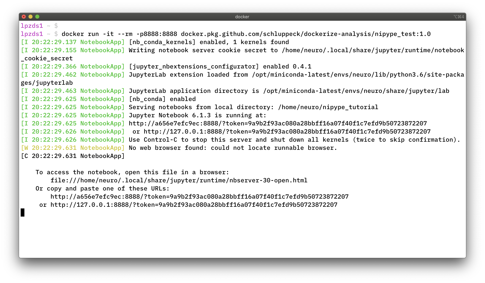

# dockerize-analysis

setting up for reproducible code for running data analysis workflows at UNUK

```bash
# to run this with a notebook server
docker run -it --rm -p8888:8888 docker.pkg.github.com/schluppeck/dockerize-analysis/nipype_test:1.0
```

Under `macos` this looks as follows (under Windows with Docker Desktop installed you should be something very similar)



Interact with the `jupyter` notebook in the way you have come to apreciate and :heart:


The first time you run this, docker needs to download the image (~4gb), so have some patience... but after this you should be able to start up the container very quickly.

Alternatively, you can docker pull the image first as per instructions under the packages tab and the `docker run` your downloaded version.

## Running from terminal

If all you need is `vim`, `emacs`, etc and the command line, you can also use `bash` as your endpoint like this

```bash
# to run this with shell
docker run -it --rm docker.pkg.github.com/schluppeck/dockerize-analysis/nipype_test:1.0 bash
```

## How to access data in there?

Example use case:

1. you are in a folder, say `~/demo` on your machine, which contains a folder called `testdata` that you want to access inside your container (read/write).

2. from within `~/demo`,  Make sure you have a local folder and run the container:

```bash
# go to folder that contains testdata
cd ~/demo  
hostname # your computer
ls # what's here ??

# now run container with shell
docker run -it \
  --name devtest \
  --mount type=bind,source="$(pwd)"/testdata,target=/home/data \
  --rm \
  docker.pkg.github.com/schluppeck/dockerize-analysis/nipype_test:1.0 \
  bash
```

3. **Check** - if everything is running ok, you are now running Linux (rather than `macos` or Windows)

```bash
hostname
#neuro@b29b9e2e54cc:/home/data$ hostname
#b29b9e2e54cc

# and 
uname -a
# Linux b29b9e2e54cc 4.19.76-linuxkit #1 SMP Tue May 26 11:42:35 UTC 2020 x86_64 GNU/Linux

# on container, data is at /home/data where we mounted!
ls /home/data
```

4. run something on some test data. On local machine copy a nifti file into `~/demo/testdata` (I tried a short fMRI run) and run mcflirt on it

```bash
# in container:
cd /home/data
# run motion comp
mcflirt -in dafni_01_FSL_4_1.nii -plots
```

5. when you exit container, files will persist (look in `~/demo/testdata`)